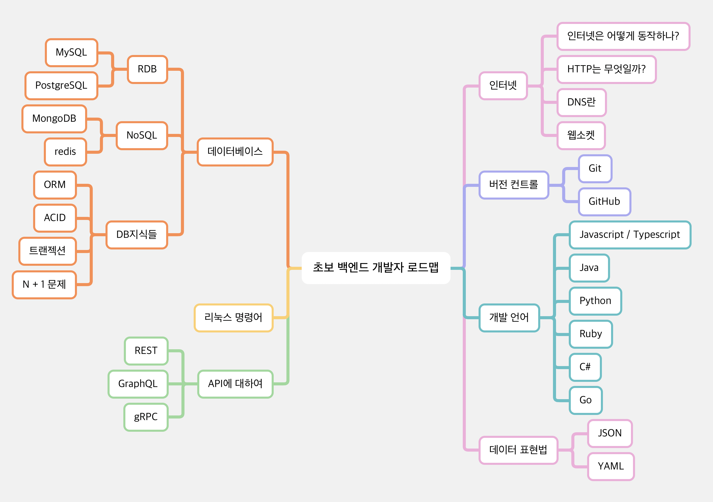

```
안녕하세요. 
저는 2008년부터 개발을 시작해서 만으로 15년 넘게 개발을 하고 있는 백엔드 개발자입니다. 
최근에는 Node.js책을 쓰고 있습니다. 
저의 경험을 살려서 백엔드 개발자를 희망하시는분들에게 조금이나마 도움이 되고자
백엔드 개발자 로드맵 영상을 찍게 되었습니다. 모쪼록 도움이 되셨으면 좋겠습니다. 

우선 백엔드 개발자가 되기 위해 알아야 하는 것들을 살펴보겠습니다. 
```


[https://roadmap.sh/backend](https://roadmap.sh/backend) 에 
가면 다른 사람들이 백엔드 개발자 로드맵으로 만들어 놓은 것을 볼 수 있습니다. 

인터넷, 깃, 데이터베이스, 캐시, CI/CD, 디자인 & 개발 원칙, 웹소켓, 보안 관련등등 굉장히 다양하게 나와있습니다. 
저 표와는 조금 다르지만, 저는 초보 개발자가 알아야 할 로드맵으로 다시 구성해보았습니다. 



roadmap.sh에 있는 모든 것을 설명드리는 것은 시간이 오래 걸리고, 
초보 개발자자 분들은 현업에서 배우시면 되는 내용들도 많이 있습니다. 
우선 제가 정리해서 보여드리는 것들을 먼저 보시고 
부족한 부분들은 해당 웹사이트 혹은 협업에서 필요한 부분들을 골라서 학습을 하시는 것을 추천드립니다. 

인터넷, 버전 컨트롤, 개발 언어, 데이터베이스, 리눅스 명령어, API는 각각의 영상으로 다시 찾아 봽겠습니다. 
감사합니다. 